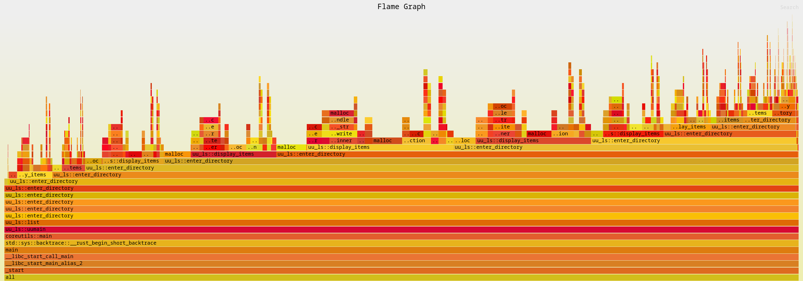
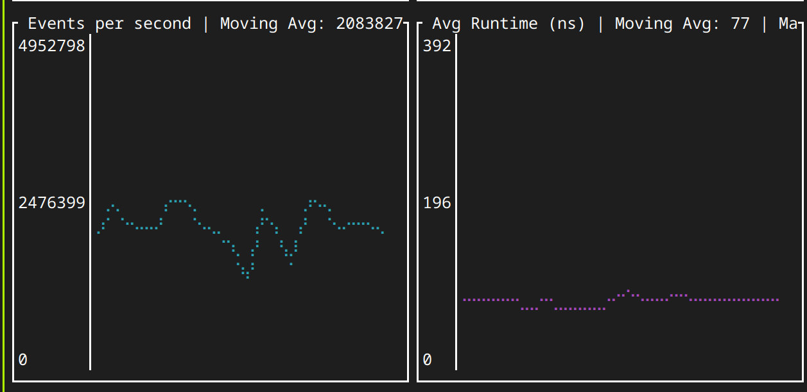

# jeprofl

jeprofl is a memory allocation profiling tool that uses eBPF technology to
analyze jemalloc allocations in your program. It may work with other
allocators, but this has not been tested.

[](assets/flamegraph.svg)

It can be used with already running program without recompilation.
Overhead with 1000x sampling is 80 ns per call under 2.5M allocations / sec.


## Features

- Attach to a specific process or program
- Support for various jemalloc allocation functions (malloc, calloc, realloc,
  etc.)
- Order results by allocation count or total memory traffic
- Set minimum and maximum allocation sizes to track
- Configurable event sampling
- Generate CSV output and flame graphs
- Tracks allocation histograms per stack trace (rounded to power of 2)

```
6ae5a0 - malloc
4e54b0 - uu_ls::enter_directory
4e54b0 - uu_ls::enter_directory
4e54b0 - uu_ls::enter_directory
4e54b0 - uu_ls::enter_directory
4db790 - uu_ls::list
23b070 - uu_ls::uumain
bb560  - coreutils::main
1c9e60 - std::sys::backtrace::__rust_begin_short_backtrace
bdf00  - main
2a010  - __libc_start_call_main
2a0c0  - __libc_start_main_alias_2
a7f00  - _start

-----------+-----------+------------+--------------------------------------------------
Size       | Count     | Percentage | Distribution
-----------+-----------+------------+--------------------------------------------------
1 B        |     16870 |      4.23% | #######
2 B        |     21716 |      5.44% | #########
4 B        |     38150 |      9.56% | ################
8 B        |    120776 |     30.27% | ##################################################
16 B       |    103586 |     25.97% | ###########################################
32 B       |     58988 |     14.79% | ########################
64 B       |      7444 |      1.87% | ###
128 B      |     14768 |      3.70% | ######
512 B      |     16638 |      4.17% | #######
Total allocations: 18.4 MiB in 398936 allocations
```

- Minimal overhead

## Limitations

- Only works with statically linked programs(for now). Can work with dynamically
  linked programs, but you should provide the path to the dylib.

## Prerequisites

1. Install bpf-linker: `cargo install bpf-linker`
2. Linux kernel with eBPF support
3. Root privileges (for attaching to processes)

## Usage

Options:

- `--pid <PID>`: Attach to a specific process ID
- `--function <FUNCTION>`: Specify the jemalloc function to trace (default:
  malloc)
- `--order-by <ORDER>`: Order results by 'count' or 'traffic' (default: traffic)
  Traffic is the total allocated size, count is the number of malloc calls.
- `--max-alloc-size <SIZE>`: Maximum allocation size to track
- `--min-alloc-size <SIZE>`: Minimum allocation size to track
- `--sample-every <N>`: Sample every Nth event
- `--skip-size <SIZE>`: Skip allocations with total allocated < SIZE bytes
- `--skip-count <COUNT>`: Skip stack traces with total allocations count < COUNT
- `--csv <PATH>`: Generate CSV output: pid, stack_id, total allocations in
  bytes, count, histogram
  "stacktrace"
- `--flame <PATH>`: Generate flame graph

Example:

```bash
RUST_LOG=info cargo xtask run --release -- --program ~/dev/oss/coreutils/target/release/coreutils --order-by count --sample-every 100  --skip-count 100 --csv malocs.csv -f malloc --flame malocs.svg
```

This will profile malloc calls in ls program, order results by total allocated
count, generate a CSV output, and create a flame graph.

# How it works

Ebpf program is attached to malloc function in the target program.
For every nth call it tracks stacktrace and size of allocation and store it to
cpu-local hashmap.

Userspace program polls these maps and resolves stacktraces to symbols.
On ctrl+c signal it aggregates all data and prints it.

## Todo

- [x] Aggregate histogram in kernel space. For now, we're just dumping all the
  data to userspace, which gives 1us overhead per call which is unacceptable.
  Pure uprobe uses 20ns per call.
- [ ] Find which malloc is used (now we assume that target is statically linked)
- [ ] Add ratatui based TUI
- [x] Produce flamegraphs
- [x] Add docs and examples
- [ ] somehow proof to ebpf verifier that number [0,1] is valid index for
  function call. For now, it gives amazing errors like:

```
Error: the BPF_PROG_LOAD syscall failed. Verifier output: 0: R1=ctx() R10=fp0
0: (bf) r6 = r1                       ; R1=ctx() R6_w=ctx()
1: (b7) r1 = 4                        ; R1_w=4
2: (63) *(u32 *)(r10 -280) = r1       ; R1_w=4 R10=fp0 fp-280=????4
3: (bf) r2 = r10                      ; R2_w=fp0 R10=fp0
4: (07) r2 += -280                    ; R2_w=fp-280
5: (18) r1 = 0xffff9f84a9a0dc00       ; R1_w=map_ptr(map=CONFIG,ks=4,vs=8)
7: (85) call bpf_map_lookup_elem#1    ; R0_w=map_value_or_null(id=1,map=CONFIG,ks=4,vs=8)
8: (15) if r0 == 0x0 goto pc+152      ; R0_w=map_value(map=CONFIG,ks=4,vs=8)
9: (79) r2 = *(u64 *)(r0 +0)          ; R0=map_value(map=CONFIG,ks=4,vs=8) R2=scalar()
10: (65) if r2 s> 0x2 goto pc+7       ; R2=scalar(smax=2)
11: (b7) r1 = 112                     ; R1_w=112
12: (15) if r2 == 0x0 goto pc+16      ; R2=scalar(smax=2,umin=1)
13: (15) if r2 == 0x1 goto pc+12      ; R2=scalar(smax=2,umin=2)
14: (15) if r2 == 0x2 goto pc+1 16: R0=map_value(map=CONFIG,ks=4,vs=8) R1=112 R2=2 R6=ctx() R10=fp0 fp-280=????mmmm
16: (b7) r1 = 96                      ; R1_w=96
17: (05) goto pc+11
29: (bf) r2 = r6                      ; R2_w=ctx() R6=ctx()
30: (0f) r2 += r1                     ; R1_w=96 R2_w=ctx(off=96)
31: (79) r8 = *(u64 *)(r2 +0)
dereference of modified ctx ptr R2 off=96 disallowed
verification time 73 usec
stack depth 280+0
processed 22 insns (limit 1000000) max_states_per_insn 0 total_states 2 peak_states 2 mark_read 2
```

## License

Apache 2.0 or MIT

## Contributing

Contributions are welcome! Please feel free to submit a Pull Request.